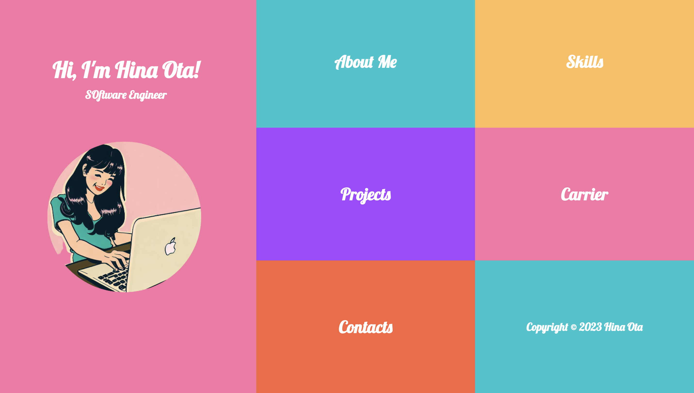

# 🌟 Hina's Retro Website 🌟

Welcome to the repository for my **personal website**! It's built with HTML, CSS, and a sprinkle of nostalgia. 

## 🚀 Overview 🚀

This website has a vintage aesthetic that transports you back to the days of vinyl records and old cars. It was inspired by my love for retro design and 50s music. 

## 🔥 Features 🔥

* **🎙 Retro Design:** The website sports a vintage aesthetic complete with nostalgic design elements. 
* **💽 Spinning Record Animation:** Enjoy a CSS-driven animation of a spinning vinyl record in the center of the homepage. 
* **📱 Responsive Layout:** The website is responsive and mobile-friendly, ensuring a seamless experience on all devices.

## 🛠 Technologies Used 🛠

* **HTML5**
* **CSS3**

## 🖥 How to View 🖥

Click below!😀
https://otahina.github.io/Mywebsite/

